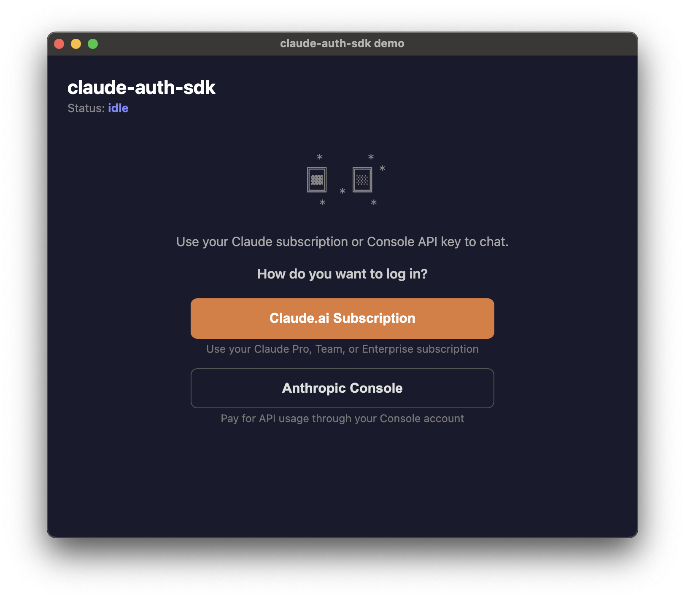
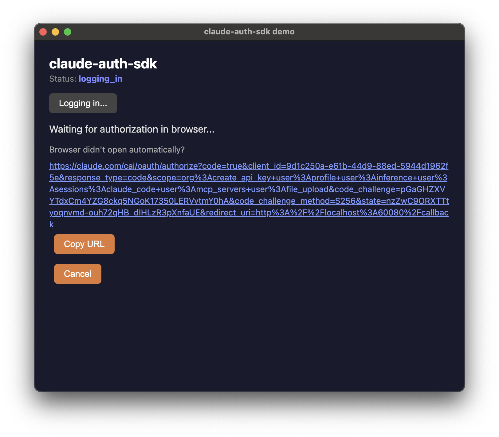
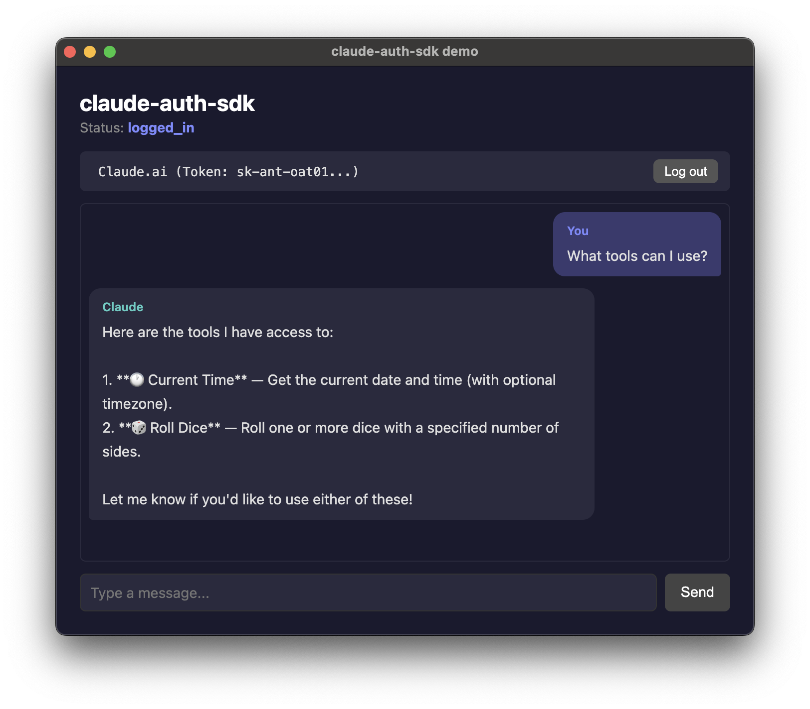
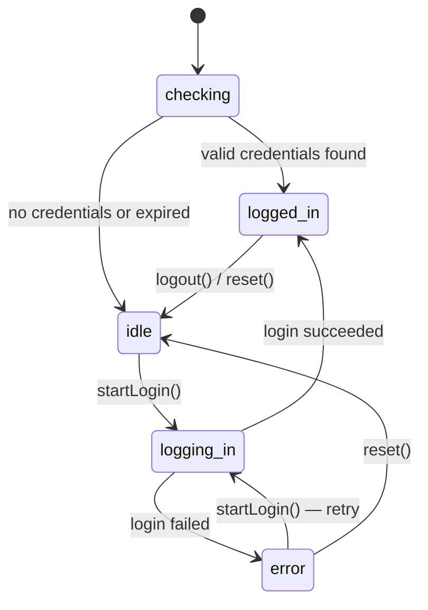

# claude-auth-sdk

[](https://www.npmjs.com/package/@claude-auth-sdk/core)
[](https://www.npmjs.com/package/@claude-auth-sdk/react)

UI-first Claude authentication for apps that use `@anthropic-ai/claude-agent-sdk`.

`@anthropic-ai/claude-agent-sdk` can work with local BYOK flows, but it does not provide a Claude login experience. Users still have to leave your product and log in from the terminal. `claude-auth-sdk` is the missing piece: it brings Claude login into your app's UI, stores credentials locally, and gives you React primitives for a complete auth flow.

## Example app

A pre-built Electron example app is available on the [Releases](https://github.com/wickedev/claude-auth-sdk/releases) page. Source code is in [`examples/electron/`](examples/electron/).

### Screenshots

| Idle | Logging in | Logged in |
| :---: | :---: | :---: |
|  |  |  |

## Install

```bash
npm install @claude-auth-sdk/core
npm install @claude-auth-sdk/react  # optional, for React apps
```

## Quick start

```ts
import { login } from '@claude-auth-sdk/core';

const result = await login('claudeai');
// Opens browser → user authenticates → credentials stored in OS credential store (fallback: ~/.claude/.credentials.json)
```

## Login

`login()` opens a browser for OAuth authentication, exchanges the authorization code for credentials, and stores them locally.

```ts
import { login } from '@claude-auth-sdk/core';

// Claude.ai OAuth — stores OAuth tokens
await login('claudeai');

// Console OAuth — exchanges for an API key, stores the key
await login('console');
```

| Mode | What gets stored |
| --- | --- |
| `claudeai` | OAuth tokens (access + refresh) |
| `console` | API key (derived from OAuth access token) |

### Options

```ts
await login('claudeai', {
  configDir: '/custom/path',                    // credential storage dir (default: ~/.claude)
  openBrowserFn: async (url) => { /* ... */ },  // custom browser opener
  fetchImpl: customFetch,                       // custom fetch implementation
});
```

### Error handling

All login failures throw `LoginError` with a machine-readable `code`:

```ts
import { login, LoginError } from '@claude-auth-sdk/core';

try {
  await login('claudeai');
} catch (err) {
  if (err instanceof LoginError) {
    switch (err.code) {
      case 'cancelled':       // user cancelled or OAuth error
      case 'timeout':         // callback server timed out
      case 'exchange_failed': // token exchange or API key creation failed
      case 'storage_failed':  // credential write failed
    }
  }
}
```

## Reading stored credentials

```ts
import { createNodeDefaultStorageAdapter } from '@claude-auth-sdk/core';

const storage = createNodeDefaultStorageAdapter();
const envelope = await storage.read();

if (envelope) {
  switch (envelope.terminal.mode) {
    case 'compat-oauth':
      console.log(envelope.terminal.credentials.accessToken);
      break;
    case 'api-key':
      console.log(envelope.terminal.apiKey);
      break;
  }
}
```

Credentials are stored in `~/.claude/` by default. On macOS, Keychain is used when available, with JSON files as fallback.

## React

`@claude-auth-sdk/react` provides a state machine for login UI. No Provider or Context needed.

### useLoginState

```tsx
import { useLoginState } from '@claude-auth-sdk/react';

function LoginScreen() {
  const { state, startLogin, logout, reset } = useLoginState();

  switch (state.status) {
    case 'checking':
      return <Spinner />;
    case 'idle':
      return <button onClick={startLogin}>Log in</button>;
    case 'logging_in':
      return (
        <p>
          Opening browser...{' '}
          <a href={state.authUrl}>Click here if it didn't open</a>
        </p>
      );
    case 'logged_in':
      return <button onClick={logout}>Log out</button>;
    case 'error':
      return <button onClick={startLogin}>Retry ({state.error.code})</button>;
  }
}
```

### State machine



| Status | Fields | Description |
| --- | --- | --- |
| `checking` | — | Reading stored credentials on init |
| `idle` | — | No valid credentials |
| `logging_in` | `authUrl` | OAuth in progress; URL for manual fallback |
| `logged_in` | `credentials` | Authenticated |
| `error` | `error` | `LoginError` with `code` and `message` |

### Credentials in logged_in state

```ts
// state.credentials is a discriminated union:
if (state.status === 'logged_in') {
  if (state.credentials.type === 'oauth') {
    state.credentials.credentials.accessToken;
  } else if (state.credentials.type === 'api-key') {
    state.credentials.apiKey;
  }
}
```

### loginStore (without React)

The same state machine is available as a plain object for non-React use:

```ts
import { loginStore } from '@claude-auth-sdk/react';

loginStore.subscribe(() => {
  console.log(loginStore.getState());
});

await loginStore.startLogin();       // default mode: 'claudeai'
await loginStore.startLogin('console');
await loginStore.logout();           // clears credentials, transitions to idle
loginStore.reset();                  // transitions to idle without clearing credentials
```

## API reference

### @claude-auth-sdk/core

| Export | Kind | Description |
| --- | --- | --- |
| `login(mode, options?)` | function | Run OAuth login flow |
| `LoginError` | class | Error with `code` property |
| `createNodeDefaultStorageAdapter(options?)` | function | Create credential storage adapter |
| `openBrowser(url)` | function | Open URL in default browser |
| `LoginMode` | type | `'claudeai' \| 'console'` |
| `LoginResult` | type | `{ mode, loggedIn: true }` |
| `LoginErrorCode` | type | Error code union |
| `LoginInternalOptions` | type | Options for `login()` |
| `OAuthCredentialBundle` | type | OAuth token set |
| `StoredCredentialEnvelope` | type | Stored credential wrapper |

### @claude-auth-sdk/react

| Export | Kind | Description |
| --- | --- | --- |
| `useLoginState()` | hook | React hook returning `{ state, startLogin, logout, reset }` |
| `loginStore` | object | Singleton `LoginStore` instance |
| `createLoginStore(deps?)` | function | Factory for custom/test instances |
| `LoginState` | type | FSM state union |
| `LoginStore` | type | Store interface |
| `LoggedInCredentials` | type | Credential discriminated union |

### macOS: "damaged and can't be opened"

The app is not code-signed. macOS Gatekeeper blocks unsigned apps by default. To open it, run in Terminal after installing:

```bash
xattr -cr "/Applications/Claude Auth SDK.app"
```

## License

[MIT](LICENSE)
